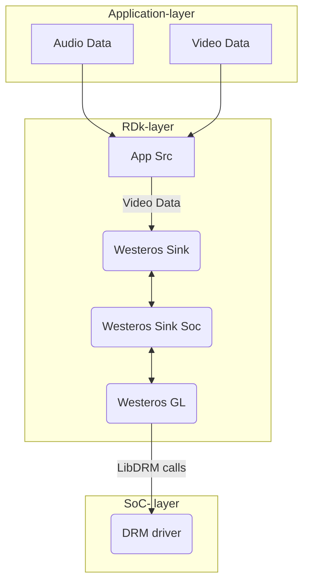

# LibDRM

## Version History

| Date [DD/MM/YY] | Comment | Version |
| --- | --- | --- |
| 08/08/23 | First Release | 1.0.0 |

## Table of Contents

- [Description](#description)
  - [Introduction](#introduction)
  - [Acronyms, Terms and Abbreviations](#acronyms-terms-and-abbreviations)
  - [References](#references)
- [Component Runtime Execution Requirements](#component-runtime-execution-requirements)
  - [Initialization and Startup](#initializatio-and-startup)
  - [Threading Model](#threading-model)
  - [Process Model](#process-model)
  - [Memory Model](#memory-model)
  - [Power Management Requirements](#power-management-requirements)
  - [Asynchronous Notification Model](#asynchronous-notification-model)
  - [Blocking calls](#blocking-calls)
  - [Internal Error Handling](#internal-error-handling)
  - [Persistence Model](#persistence-model)
- [Non-functional requirements](#non-functional-requirements)
  - [Logging and debugging requirements](#logging-and-debugging-requirements)
  - [Memory and performance requirements](#memory-and-performance-requirements)
  - [Quality Control](#quality-control)
  - [Licensing](#licensing)
  - [Build Requirements](#build-requirements)
  - [Variability Management](#variability-management)
  - [Platform or Product Customization](#platform-or-product-customization)
- [Interface API Documentation](#interface-api-documentation)
  - [Theory of operation and key concepts](#theory-of-operation-and-key-concepts)
  - [Diagrams](#diagrams)
   - [libdrm Code Flow](#libdrm-code-flow)
  - [Data Structures and Defines](#data-structures-and-defines)

## Description
Libdrm is a library created to facilitate the interface of user-space programs with the DRM subsystem. This library is merely a wrapper that provides a function written in C for every ioctl of the DRM API, as well as constants, structures and other helper elements. The use of libdrm not only avoids exposing the kernel interface directly to applications, but presents the usual advantages of reusing and sharing code between programs.

### Introduction
In Westeros, the LibDRM module is responsible for managing the graphics and display hardware, providing a direct and efficient interface between the graphics hardware and the Westeros Renderer. This allows for efficient and high-performance rendering of graphical content and video streams, while also ensuring that the hardware is used in a secure and controlled manner. It provides a standardized interface for interacting with the graphics hardware, allowing the Westeros Renderer to access the hardware resources in a uniform and efficient manner. This helps to ensure that the graphics and video components of the system are properly synchronized and rendered in real-time.

### Acronyms, Terms and Abbreviations

- `HAL`    - Hardware Abstraction Layer
- `API`    - Application Programming Interface
- `RDK`    - Reference Design Kit for All Devices
- `SoC`    - System on Chip
- `DRM`    - Direct Rendering Manager
- `GPU`    - Graphics Processing Unit
- `wst`    - westeros
- `ctx`    - Context
- `crtc`   - Cathode Ray Tube Controller
- `Caller` - Any user of the interface

### References
1. [http://dri.freedesktop.org/libdrm/](https://dri.freedesktop.org/libdrm/)
2. [libdrm](https://github.com/Distrotech/libdrm)
3. [Beyond Linux® From Scratch (System V Edition)](https://www.linuxfromscratch.org/blfs/view/svn/x/libdrm.html)
4. [DRM Internals](https://www.kernel.org/doc/html/v4.11/gpu/drm-internals.html)
5. [Direct Rendering Manager](https://man.archlinux.org/man/drm.7.en)

## Component Runtime Execution Requirements
Video or graphics rendering is dependent on the capability of the connected GPU and if no video card is connected, an error will be returned. Each GPU detected by DRM is referred to as a DRM device, and a device file /dev/dri/cardX (where X is a sequential number) is created to interface with it. User-space programs that want to talk to the GPU must open this file and use ioctl calls to communicate with DRM. 

### Initialization and Startup
The first call to the libdrm module would be drmSetMaster() to acquire the status of DRM master. IOCTL calls can only be invoked by the process considered the "master" of a DRM device, usually called DRM-Master. The display server is commonly the process that acquires the DRM-Master status in every DRM device it manages and keeps these privileges for the entire graphical session until it finishes or dies. 

### Threading Model
HAL is expected to be thread safe. There is no restriction on the vendor to create any number of threads to meet the operational requirements. Any caller invoking the APIs should ensure calls are made in a thread safe manner.

### Process Model
There are several operations (ioctls) in the DRM API that either for security purposes or for concurrency issues must be restricted to be used by a single user-space process per device. To implement this restriction, DRM limits such ioctls to be only invoked by the process considered the "master" of a DRM device, usually called DRM-Master. Only one of all processes that have the device node /dev/dri/cardX opened will have its file handle marked as master, specifically the first calling the drmSetMaster() API. Any attempt to use one of these restricted ioctls without being the DRM-Master will return an error.

### Memory Model
By using memory model, applications can allocate and manage memory resources for use by the graphics hardware in a safe and efficient manner. The libdrm API's provide a comprehensive set of functions for managing memory resources in the graphics stack, allowing applications to build high-performance graphics applications.

### Power Management Requirements
There is no requirement for the component to participate in power management. The driver should be designed to minimize power consumption during idle periods and use power-saving modes when appropriate.

### Asynchronous Notification Model
- drmHandleEvent: This call is used to handle events that are received by an application from the DRM module. It can be used to receive notifications of events such as hotplug, mode change, page flip, and VBlank events.

### Blocking calls
There are no blocking calls for this interface.

### Internal Error Handling
All the `APIs` must return error synchronously as a return argument. `HAL` is responsible for handling system errors (e.g. out of memory) internally.
libdrm calls return 0 if successful, or -1 otherwise.

### Persistence Model
There is no requirement for the interface to persist any setting information.

## Non-functional requirements

### Logging and debugging requirements
This interface is required to support DEBUG, INFO and ERROR messages. ERROR logs should be enabled by default. DEBUG and INFO is required to be disabled by default and enabled when needed.

### Memory and performance requirements
This interface is required to not cause excessive memory and CPU utilization. 

### Quality Control

- This interface is required to perform static analysis, our preferred tool is Coverity.
- Have a zero-warning policy with regards to compiling. All warnings are required to be treated as error.
- Copyright validation is required to be performed, e.g.: Black duck, FossID.
- Use of memory analysis tools like Valgrind are encouraged, to identify leaks/corruptions.
- `HAL` Tests will endeavour to create worst case scenarios to assist investigations.
- Improvements by any party to the testing suite are required to be fed back.

### Licensing
The `HAL` implementation is expected to released under the Apache License 2.0.

### Build Requirements
LibDRM code is downloaded from open source repo and build in platform to generate libdrm.so shared library file.

### Variability Management
Any changes in the `APIs` should be reviewed and approved by the component architects.

### Platform or Product Customization
No product customization is expected from SoC vendors from this module. Any potential platform specific customization needs to be communicated well in advance to the respective architect team for the purpose of effective planning.

## Interface API Documentation
`API` documentation will be provided by Doxygen which will be generated from the header files.

### Theory of operation and key concepts

- LibDRM  is a kernel subsystem in linux that provides support for rendering graphics and managing display devices. It is reponsible for interacting with the graphics hardware and providing direct access to it. It enables hardware acceleration for video decoding and rendering.

- For video playback, the client application (like a media player) runs on top of the Wayland protocol communicating with the westeros-compositor. The compositor, in turn utuilizes the capabilities of this drm subsystem to facilitate efficient video rendering and display. The drm calls are made by the westeros-gl or westeros-sink-soc component.

- During pre-playback scenario, after the compositor instance has been created and setting up of EGL is done, initializing of Westeros-gl takes place and further it gets WESTEROS_GL GRAPHICS_MAX_SIZE/FPS/DRM card. Then drm calls happens for getting encoder info, crtc properties, connector properties and getting plane resources/properties.

- During video-playback scenario, when video-server connection is established post initialization of display and video server, video resource id is set for this connection. Any existing overlay plane is freed and allocation of a new overlay plane happens for either graphics or primary video. Next, setting of z-order for the respective video plane & video resource ID is done and session info is sent to video server by westeros-sink-soc to westeros-gl.

- Westeros-gl gets frame and buffer related info and drm call drmPrimeFDToHandle() is made to drm driver. AV sync session is initialized and further video playback happens. Post EOS, drmModeRmFB() destroys the given framebuffer. It is used to remove a framebuffer previously created with the drmModeAddFB function.

- At different stages during the overall lifecycle of a video playback, drm calls are made that communicates with the lower level drivers.

### Diagrams

#### libdrm Code Flow
TBD

### Data Structures and Defines
SoC vendors should refer to the header files under the 'include' directory for API implementation: https://github.com/rdkcentral/libdrm-halif/tree/rdk-dev/include/
