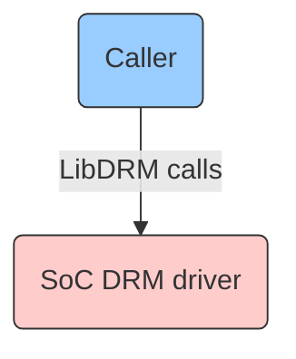
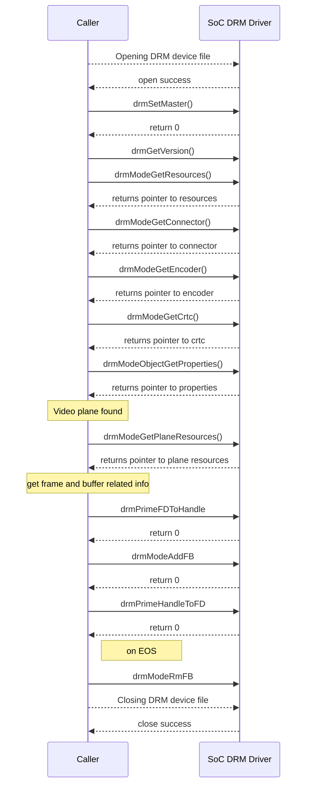

# LibDRM

## Version History

| Date [DD/MM/YY] | Comment | Version |
| --- | --- | --- |
| /08/23 | Initial review fixes	| 1.0.1 |
| 08/08/23 | First Release | 1.0.0 |

## Table of Contents

- [Description](#description)
  - [Introduction](#introduction)
  - [Acronyms, Terms and Abbreviations](#acronyms-terms-and-abbreviations)
  - [References](#references)
- [Component Runtime Execution Requirements](#component-runtime-execution-requirements)
  - [Initialization and Startup](#initializatio-and-startup)
  - [Threading Model](#threading-model)
  - [Process Model](#process-model)
  - [Memory Model](#memory-model)
  - [Power Management Requirements](#power-management-requirements)
  - [Asynchronous Notification Model](#asynchronous-notification-model)
  - [Blocking calls](#blocking-calls)
  - [Internal Error Handling](#internal-error-handling)
  - [Persistence Model](#persistence-model)
- [Non-functional requirements](#non-functional-requirements)
  - [Logging and debugging requirements](#logging-and-debugging-requirements)
  - [Memory and performance requirements](#memory-and-performance-requirements)
  - [Quality Control](#quality-control)
  - [Licensing](#licensing)
  - [Build Requirements](#build-requirements)
  - [Variability Management](#variability-management)
  - [Platform or Product Customization](#platform-or-product-customization)
- [Interface API Documentation](#interface-api-documentation)
  - [Theory of operation and key concepts](#theory-of-operation-and-key-concepts)
  - [Diagrams](#diagrams)
   - [libdrm Code Flow](#libdrm-code-flow)
  - [Data Structures and Defines](#data-structures-and-defines)

## Description
`LibDRM` is a library created to facilitate the interface of user-space programs with the `DRM` subsystem. This interface is merely a wrapper that provides a function written in C for every `IOCTL` of the `DRM` `API`, as well as constants, structures and other helper elements. The use of `LibDRM` not only avoids exposing the kernel interface directly to applications, but presents the usual advantages of reusing and sharing code between programs.

The diagram below shows the interaction between `Caller` and `SoC` `DRM` Driver.

### Introduction
`LibDRM` is a userspace library for accessing the Direct Rendering Manager (`DRM`) on operating systems that support the `IOCTL` interface. `DRM` is a kernel-level API that provides access to the graphics hardware, such as the `GPU`, memory, and display connectors. This module is responsible for managing the graphics and display hardware, providing a direct interface between the graphics hardware and the `Caller`'s renderer. This allows for efficient and high-performance rendering of graphical content and video streams, while also ensuring that the hardware is used in a secure and controlled manner. It provides a standardized interface for interacting with the graphics hardware, allowing the `Caller`'s renderer to access the hardware resources in a uniform manner. This helps to ensure that the graphics and video components of the system are properly synchronized and rendered in real-time.

`LibDRM` provides a wrapper for the `DRM` `IOCTL`s, which makes it easier for userspace applications to interact with the DRM driver.

### Acronyms, Terms and Abbreviations

- `HAL`    - Hardware Abstraction Layer
- `API`    - Application Programming Interface
- `RDK`    - Reference Design Kit for All Devices
- `SoC`    - System on Chip
- `DRM`    - Direct Rendering Manager
- `LibDRM` - Direct Rendering Manager Library
- `GPU`    - Graphics Processing Unit
- `crtc`   - cathod ray tube controller
- `IOCTL`  -  Input-Output Control
- `Caller` - Any user of the interface

### References
Documentation on DRM driver details - [DRM Internals](https://www.kernel.org/doc/html/v5.4/gpu/drm-internals.html)

## Component Runtime Execution Requirements
Video or graphics rendering is dependent on the capability of the connected `GPU` and if no video card is connected, an error will be returned. Each `GPU` detected by `DRM` is referred to as a `DRM` device, and a device file /dev/dri/cardX (where X is a sequential number) is created to interface with it. User-space programs that want to talk to the `GPU` must open this file and use `LibDRM` calls to communicate with `DRM`. 

These requirements ensure that the `HAL` executes correctly within the run-time environment that it will be used in. Failure to meet these requirements will likely result in undefined and unexpected behaviour.

### Initialization and Startup
The first call to the `LibDRM` module will be `drmSetMaster`() to acquire the status of `DRM` master. `IOCTL` calls can only be invoked by the process considered the "master" of a `DRM` device, usually called DRM-Master. The display server is commonly the process that acquires the DRM-Master status in every `DRM` device it manages and keeps these privileges for the entire graphical session.

### Threading Model
`HAL` is expected to be thread safe. Any `Caller` invoking the `API`s should ensure calls are made in a thread safe manner.

### Process Model
This interface is required to support a single instantiation with a single process.

### Memory Model
Following eleven pair of `API`'s can be noted for memory allocation and correspondingly freeing it:

1. `drmModeAtomicAlloc`() call allocates memory for a new drmModeAtomicReq structure for building a set of atomic mode setting or property modification requests and initializes its fields to zero. While `	drmModeAtomicFree`() call is used to free resources allocated by `drmModeAtomicAlloc`() function call or any similar functions that return an atomic mode setting request. This function takes a pointer to the request as a parameter and deallocates any resources that were allocated during the building of the request.

2. `drmFreeVersion`() call is a utility function that is used to free memory allocated by the `drmGetVersion`() function in the drm library. While `drmGetVersion`() call retrieves the version information for the `DRM` device represented by the file descriptor passed in as an argument and returns pointer to a 'drmVersion' structure which should be freed with `drmFreeVersion`().

3. `drmModeGetConnector`() is for connector manipulation and retrieves all information about the connector connectorId. While `drmModeFreeConnector`() call is used to free the memory allocated to a 'drmModeConnector' structure returned by the `drmModeGetConnector`() function.

4. `drmModeGetCrtc`() call is a `crtc` function and retrieves information about the crtcId. While `drmModeFreeCrtc`() call is used to free the resources allocated for a `crtc`. The resources may include memory allocation or any associated properties.

5. `drmModeGetEncoder`() call is an Encoder function and is used to retrieve an encoder object associated with a given encoder ID. The function returns a pointer to a drmModeEncoder structure that contains information about the encoder. While `drmModeFreeEncoder`() call is used to free the resources allocated for an encoder structure previously allocated with `drmModeGetEncoder`(). The function takes a pointer as input and frees the memory associated with it. 

6. `drmModeGetProperty`() call is used to retrieve the drmobject property metadata associated with a particular drm object property ID and it takes two arguments, the drmFd which is the file descriptor of the drm device, and props->props[j] which is the property ID of the object and returns a pointer. While `drmModeFreeProperty`() call is used to free the memory allocated for a drmproperty. When you retrieve the properties of a drm object using `drmModeObjectGetProperty`(), the function returns a list of properties that includes the name, ID, and value of each property. To free that memory allocated for a specific property, we use this function.

7. `drmModeGetPropertyBlob`() call retrieves a binary blob property from the kernel's mode-setting infrastructure. It takes two arguments: the first is the file descriptor for the DRM device, and the second is the ID of the blob property to retrieve. While `drmModeFreePropertyBlob`() call is used to free memory allocated for the property blob. A property blob is a binary blob of data that represents a set of properties for an object in drm, such as a connector or a `crtc`. It takes a single parameter, which is a pointer to a structure that represents the property blob. Failing to free a property blob can cause memory leaks and potentially lead to system instability. 

8. `drmModeObjectGetProperties`() call is used to retrieve the properties of a drmobject associated (with a drm plane) that has a given objectId and objectType and also takes the file descriptor fd for the drmdevice as an argument. While`drmModeFreeObjectProperties`() call is used to free the memory allocated by `drmModeObjectGetProperties`() when retrieving properties for a DRM object.

9. `drmModeGetPlane`() call retrieves information about a specific plane and takes two arguments: a file descriptor of the drm device and the ID of the plane resource to retrieve information about. While `drmModeFreePlane`() call is used to free the resources allocated to a drmModePlane structure obtained from `drmModeGetPlane`(). 

10. `drmModeGetPlaneResources`() call retrieves a list of available planes in the system. It takes the file descriptor of the drmdevice as an input and returns a pointer. This function can allow the caller to obtain information about the available planes and their capabilities. While `drmModeFreePlaneResources`() call frees the memory allocated by `drmModeGetPlaneResources`() function, which is used to get information about planes in the drm device.

11. `drmModeGetResources`() call retrieves all of the resources associated with a card. While `drmModeFreeResources`() call is used to free the memory allocated by a previous call. When a user-space application needs to interact with the drm kernel subsystem for rendering, display, and other graphics-related functionality, it must first obtain a handle to the drmdevice and retrieve the available resources using drmModeGetResources(). Once the necessary information is retrieved, and after it is used, `drmModeFreeResources`() should be called to release the allocated resources to prevent memory leaks.

### Power Management Requirements
This interface is not required to be involved in power management. In general, the `SoC` `DRM` driver should be designed to minimize the power consumption of the device.

### Asynchronous Notification Model
`drmHandleEvent`() call is used to handle events that are received by an application from the `DRM` module. It can be used to receive notifications of events such as hotplug, mode change, page flip, and VBlank events.

### Blocking calls
There are no blocking calls for this interface.

### Internal Error Handling
All the `API`s must return error synchronously as a return argument. `HAL` is responsible for handling system errors (e.g. out of memory) internally.

### Persistence Model
There is no requirement for the interface to persist any settings information.

## Non-functional requirements

### Logging and debugging requirements
This interface is required to support DEBUG, INFO and ERROR messages. ERROR logs should be enabled by default. DEBUG and INFO is required to be disabled by default and enabled when needed.

### Memory and performance requirements
This interface is required to not cause excessive memory and CPU utilization. 

### Quality Control

- This interface is required to perform static analysis, our preferred tool is Coverity.
- Have a zero-warning policy with regards to compiling. All warnings are required to be treated as error.
- Copyright validation is required to be performed, e.g.: Black duck, FossID.
- Use of memory analysis tools like Valgrind are encouraged, to identify leaks/corruptions.
- `HAL` Tests will endeavour to create worst case scenarios to assist investigations.
- Improvements by any party to the testing suite are required to be fed back.

### Licensing
The `HAL` implementation is expected to released under the Apache License 2.0.

### Build Requirements
`LibDRM` code is downloaded from open source repo to generate libdrm.so shared library file. The build mechanism should be independent of Yocto.

### Variability Management
Any changes in the `API`s should be reviewed and approved by the component architects.

### Platform or Product Customization
No product customization is expected from `SoC` vendors from this module. 

## Interface API Documentation
`API` documentation will be provided by Doxygen which will be generated from the header files.

### Theory of operation and key concepts
The `Caller` is expected to have complete control over calling the `LibDRM` `API`s.

- `LibDRM`  is a kernel subsystem in linux that provides support for rendering graphics and managing display devices. It is reponsible for interacting with the graphics hardware and providing direct access to it. It enables hardware acceleration for video decoding and rendering.

- There are several operations (`IOCTL`s) in the `DRM` `API` that either for security purposes or for concurrency issues must be restricted to be used by a single user-space process per device. To implement this restriction, `DRM` limits such `IOCTL`s to be only invoked by the process considered the "master" of a `DRM` device, usually called DRM-Master. Only one of all processes that have the device node /dev/dri/cardX opened will have its file handle marked as master, specifically the first calling the `drmSetMaster`() `API`. Any attempt to use one of these restricted `IOCTL`s without being the DRM-Master will return an error.

- At different stages during the overall lifecycle of a video playback, `DRM` calls are made that communicates with the lower-level SoC DRM Driver.

- Following are the 38 mandatory `LibDRM` `API` calls for `SoC` Implementation:

`drmFreeVersion`(), `drmGetVersion`(), `drmHandleEvent`(), `drmModeAddFB`(), `drmModeAddFB2`(), `drmModeAddFB2WithModifiers`(), `drmModeAtomicAddProperty`(), `drmModeAtomicAlloc`(), `drmModeAtomicCommit`(), `drmModeAtomicFree`(), `drmModeCreatePropertyBlob`(), `drmModeDestroyPropertyBlob`(), `drmModeFreeConnector`(), `drmModeFreeCrtc`(), `drmModeFreeEncoder`(), `drmModeFreeObjectProperties`(), `drmModeFreePlane`(), `drmModeFreePlaneResources`(), `drmModeFreeProperty`(), `drmModeFreePropertyBlob`(), `drmModeFreeResources`(), `drmModeGetConnector`(), `drmModeGetCrtc`(), `drmModeGetEncoder`(), `drmModeGetPlane`(), `drmModeGetPlaneResources`(), `drmModeGetProperty`(), `drmModeGetPropertyBlob`(), `drmModeGetResources`(), `drmModeObjectGetProperties`(), `drmModePageFlip`(), `drmModeRmFB`(), `drmModeSetCrtc`(), `drmModeSetPlane`(), `drmPrimeFDToHandle`(), `drmPrimeHandleToFD`(), `drmSetMaster`(), `drmWaitVBlank`().

### Diagrams

#### General LibDRM Code Flow

### Data Structures and Defines
`SoC` vendors can refer to the header files for `API` implementation under the below mentioned downloadable `LibDRM` package link: https://dri.freedesktop.org/libdrm/libdrm-2.4.100.tar.gz 

Required header files: xf86drm.h and xf86drmMode.h