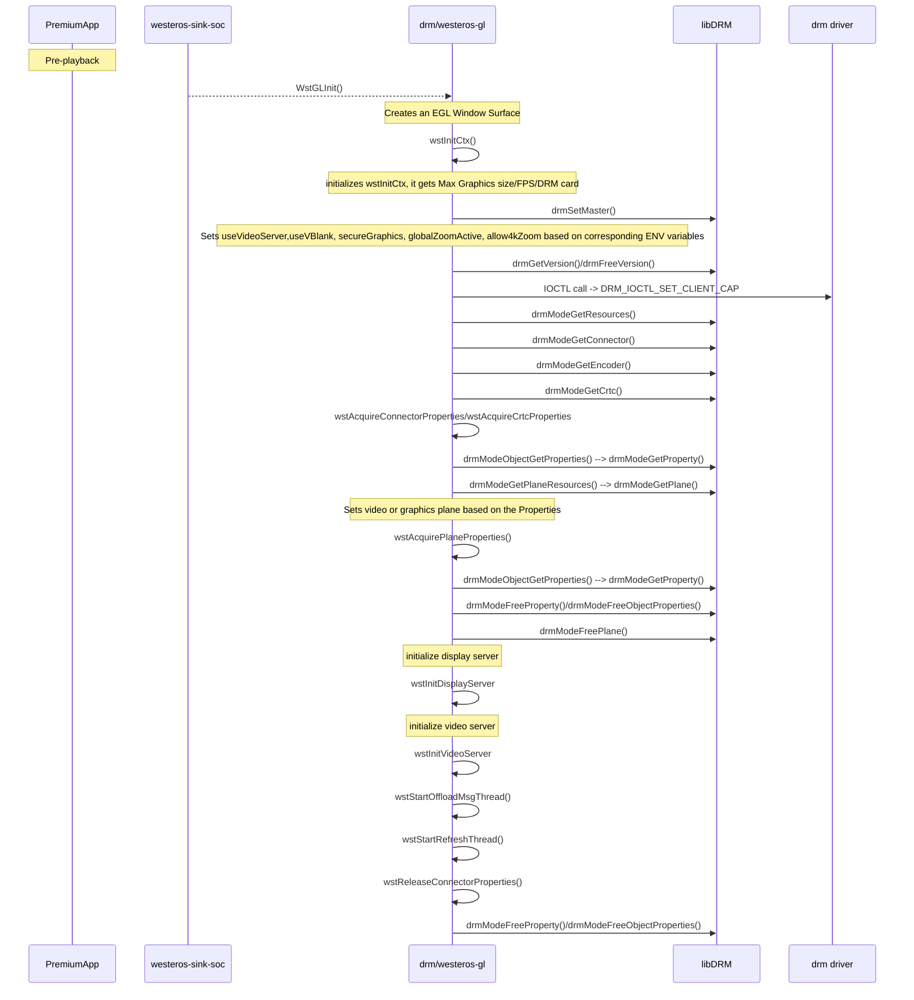
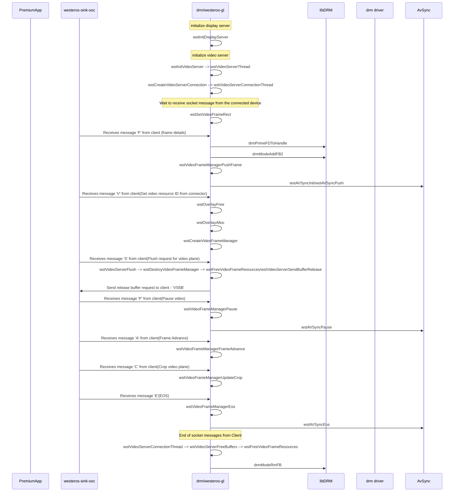

# LibDRM

## Version History

| Date | Author | Comment | Version |
| --- | --------- | --- | --- |
| 08/08/23 | Premium App Team | First Release | 1.0.0 |

## Table of Contents

- [Description](#description)
  - [Introduction](#introduction)
  - [Repo Details](#repo-details)
  - [Acronyms, Terms and Abbreviations](#acronyms-terms-and-abbreviations)
  - [References](#references)
- [Component Runtime Execution Requirements](#component-runtime-execution-requirements)
  - [Initialization and Startup](#initializatio-and-startup)
  - [Threading Model](#threading-model)
  - [Process Model](#process-model)
  - [Memory Model](#memory-model)
  - [Power Management Requirements](#power-management-requirements)
  - [Asynchronous Notification Model](#asynchronous-notification-model)
  - [Blocking calls](#blocking-calls)
  - [Internal Error Handling](#internal-error-handling)
  - [Persistence Model](#persistence-model)
- [Non-functional requirements](#non-functional-requirements)
  - [Logging and debugging requirements](#logging-and-debugging-requirements)
  - [Memory and performance requirements](#memory-and-performance-requirements)
  - [Quality Control](#quality-control)
  - [Licensing](#licensing)
  - [Build Requirements](#build-requirements)
  - [Variability Management](#variability-management)
  - [Platform or Product Customization](#platform-or-product-customization)
- [Interface API Documentation](#interface-api-documentation)
  - [Theory of operation and key concepts](#theory-of-operation-and-key-concepts)
  - [Diagrams](#diagrams)
  - [Data Structures and Defines](#data-structures-and-defines)

## Description

### Introduction

In Westeros, the LibDRM module is responsible for managing the graphics and display hardware, providing a direct and efficient interface between the graphics hardware and the Westeros Renderer. This allows for efficient and high-performance rendering of graphical content and video streams, while also ensuring that the hardware is used in a secure and controlled manner. It provides a standardized interface for interacting with the graphics hardware, allowing the Westeros Renderer to access the hardware resources in a uniform and efficient manner. This helps to ensure that the graphics and video components of the system are properly synchronized and rendered in real-time.

### Repo Details
| Module  | RDK repo | Filepath/Filename  |
| --- | --- | --- |
| libdrm | https://code.rdkcentral.com/r/components/opensource/westeros  | files: xf86drm.h; xf86drmMode.h |

### Acronyms, Terms and Abbreviations

- `HAL`    - Hardware Abstraction Layer
- `API`    - Application Programming Interface
- `DRM`    - Direct Rendering Manager
- `GPU`    - Graphics Processing Unit
- `wst`    - westeros
- `ctx`    - Context
- `crtc`   - Cathode Ray Tube Controller

### References
1. [libdrm](https://github.com/Distrotech/libdrm)
2. [Beyond Linux® From Scratch (System V Edition)](https://www.linuxfromscratch.org/blfs/view/svn/x/libdrm.html)
3. [DRM Internals](https://www.kernel.org/doc/html/v4.11/gpu/drm-internals.html)
4. [Direct Rendering Manager](https://man.archlinux.org/man/drm.7.en)

## Component Runtime Execution Requirements
Video or graphics rendering is dependent on the capabiity of the connected GPU and if no video card is connected an error will be returned. The IOCTL calls can only be only invoked by the process considered the "master" of a DRM device, usually called DRM-Master. The display server is commonly the process that acquires the DRM-Master status in every DRM device it manages and keeps these privileges for the entire graphical session until it finishes or dies. 

### Initialization and Startup
During pre-playback scenario, after the compositor instance has been created and setting up of EGL is done, initializing of WstGLInit() takes place and further it gets WESTEROS_GL GRAPHICS_MAX_SIZE/FPS/DRM card. 
Drm calls happens for getting encoder info, crtc properties, connector properties and getting plane resources/properties starting with getting drm version.

### Threading Model
This interface is not required to be thread safe. Any caller invoking the `APIs` should ensure calls are made in a thread safe manner.

### Process Model
There are several operations (ioctls) in the DRM API that either for security purposes or for concurrency issues must be restricted to be used by a single user-space process per device. To implement this restriction, DRM limits such ioctls to be only invoked by the process considered the "master" of a DRM device, usually called DRM-Master. Only one of all processes that have the device node /dev/dri/cardX opened will have its file handle marked as master, specifically the first calling the drmSetMaster() API.

### Memory Model
By using memory model, applications can allocate and manage memory resources for use by the graphics hardware in a safe and efficient manner. The libdrm API's provide a comprehensive set of functions for managing memory resources in the graphics stack, allowing applications to build high-performance graphics applications.

### Power Management Requirements
The DRM module needs to implement power management techniques to optimize power consumption in devices. The driver should be designed to minimize power consumption during idle periods and use power-saving modes when appropriate.

### Asynchronous Notification Model
DRM API calls that can be used for asynchronous notifications:
1. drmHandleEvent: This call is used to handle events that are received by an application from the DRM module. It can be used to receive notifications of events such as hotplug, mode change, page flip, and VBlank events.
2. drmModeObjectGetProperties: This call is used to retrieve the properties of a specific object, such as a plane or connector. Applications can use this call to retrieve information about the state of the graphics hardware and receive notifications of changes to the object's properties.
DRM also uses IOCTL calls for asynchrous communication. ##################

### Blocking calls
DRM module includes blocking calls that can be used by applications to interact with the graphics hardware. Blocking calls are calls that can block the application's execution until a particular event occurs, such as the completion of a graphics operation or the availability of a graphics resource. Here are some examples of blocking calls provided by the DRM module using DRM API's:

1. drmModePageFlip: This call is used to flip the display buffer to a new frame. It can block the calling application until the flip operation is complete.
2. drmModeSetCrtc: This call is used to set the mode of the display controller. It can block the calling application until the mode setting operation is complete.
3. drmWaitVBlank: This call is used to wait for the vertical blanking period of the display. It can block the calling application until the next vertical blanking interval occurs.
4. drmPrimeFDToHandle: This call is used to import a buffer object into a DRM-managed memory domain. It can block the calling application until the buffer object is fully imported.

drmIoctl calls is also used to send various ioctl calls to the kernel-level DRM module. Some of these ioctl calls may block the calling application until the operation is complete. 
These blocking calls can be useful in certain scenarios where the application needs to wait for a particular event to occur before proceeding. However, they can also impact application performance and responsiveness if used excessively. Developers need to carefully consider the trade-off between blocking and non-blocking calls when designing applications that use the DRM module. Generally, non-blocking calls are preferred for high-performance applications, while blocking calls may be more appropriate for applications that require precise timing or synchronization with the graphics hardware.

### Internal Error Handling
All the `APIs` must return error synchronously as a return argument. `HAL` is responsible for handling system errors (e.g. out of memory) internally.

### Persistence Model
- The Direct Rendering Manager (DRM) module includes a persistence model that allows processes to maintain ownership of the graphics hardware resources across multiple execution contexts. This persistence model is important for scenarios where multiple processes need to share access to the graphics hardware, such as in a multi-user or multi-application environment.

- The DRM module uses a combination of file descriptor passing and reference counting to implement its persistence model. When a process opens a file descriptor to a DRM device node, it gains access to the graphics hardware resources associated with that node. The DRM module maintains a reference count for each resource to track the number of processes that have access to it.

- When a process exits or closes its file descriptor to the DRM device node, the DRM module decrements the reference count for each resource associated with the process. If the reference count drops to zero, the resources are released and become available for other processes to use.

## Non-functional requirements

### Logging and debugging requirements
This interface is required to support DEBUG, INFO and ERROR messages. ERROR logs should be enabled and INFO logs can be enabled. DEBUG should be disabled by default and enabled when required.

### Memory and performance requirements
This interface is required to not cause excessive memory and CPU utilization. The Direct Rendering Manager (DRM) module has several memory and performance requirements that must be considered when designing and implementing graphics drivers based on it. Here are some of the key requirements:

- Memory usage: The DRM module needs to manage memory usage efficiently to ensure that the graphics driver does not consume too much memory, which can impact system performance and stability. The driver should use memory allocation functions to allocate memory for buffers and other resources.

- Memory management: The DRM module needs to implement efficient memory management techniques to optimize performance and minimize memory usage. This includes techniques such as memory mapping, caching, and buffer sharing to manage memory efficiently and ensure that data is transferred between the graphics hardware and system memory as efficiently as possible.

- Performance optimization: The DRM module needs to be optimized for performance to ensure that the graphics driver can provide high-quality graphics and video playback. This includes optimizing the driver for specific hardware platforms, using hardware accelerators when available, and minimizing CPU usage. The driver should be designed to minimize latency and provide high frame rates for smooth animation and video playback.

### Quality Control

- This interface is required to perform static analysis, our preferred tool is Coverity.
- Open-source copyright validation is required to be performed, e.g.: Black duck, FossID.
- Have a zero-warning policy with regards to compiling. All warnings are required to be treated as errors.
- Use of memory analysis tools like Valgrind are encouraged, to identify leaks/corruptions.
- Tests will endeavour to create worst case scenarios to assist investigations.

### Licensing
The `HAL` implementation is expected to released under the Apache License 2.0.

### Build Requirements
Some common build requirements include for the DRM module:
1. Kernel version: The DRM module is part of the Linux kernel, so the kernel version used by the SoC vendor must be compatible with the version of the DRM module being used.
2. Hardware support: The DRM module must be built with support for the specific graphics hardware used by the SoC vendor (like adding support for custom hardware accelerators, memory architectures, or display interfaces).
3. Compiler and toolchain: The DRM module must be built with a compatible compiler and toolchain.
4. Configuration options: The DRM module includes a number of configuration options that can be used to enable or disable specific features or optimizations.
5. Dependencies: The DRM module may depend on other kernel modules or libraries, such as the kernel's memory management subsystem or the libdrm user-space library. The SoC vendor must ensure that these dependencies are also built and installed correctly.
6. Testing: The DRM module must be tested thoroughly to ensure that it meets the performance, stability, and compatibility requirements of the SoC vendor's platform. This may involve writing custom test cases or using existing test suites, such as the kernel's regression test suite or the libdrm test suite.

In this way the SoC vendor can provide a high-performance and stable graphics subsystem.

### Variability Management
Any changes in the `APIs` should be reviewed and approved by the component architects.

### Platform or Product Customization
The DRM module is a critical component of modern graphics drivers, and SoC vendors can customize it in ways to meet the specific requirements of their hardware and software products. By customizing the DRM driver, APIs, modesetting, memory management and power management, SoC vendors can ensure that their graphics subsystem provides optimal performance, power efficiency, and feature support for their customers.

## Interface API Documentation

`API` documentation will be provided by Doxygen which will be generated from the header files.

### Theory of operation and key concepts

- LibDRM  is a kernel subsystem in linux that provides support for rendering graphics and managing display devices. It is reponsible for interacting with the graphics hardware and providing direct access to it. It enables hardware acceleration for video decoding and rendering. 

- For video playback, the client application (like a media player) runs on top of the Wayland protocol communicating with the westeros-compositor. The compositor, in turn utuilizes the capabilities of this drm subsystem to facilitate efficient video rendering and display. The drm calls are made by the westeros-gl or westeros-sink-soc component.

- During pre-playback scenario, after the compositor instance has been created and setting up of EGL is done, initializing of WstGLInit() takes place and further it gets WESTEROS_GL GRAPHICS_MAX_SIZE/FPS/DRM card. Then drm calls happens for getting encoder info, crtc properties, connector properties and getting plane resources/properties.

- During video-playback scenario, when video-server connection is established post initiliazation of display and video server, video resource id is set for this connection. Any existing overlay plane is freed and allocation of a new overlay plane happens for either graphics or primary video. Next setting of z-order for the respective video plane & video resource ID is done and session info is sent to video server by westeros-sink-soc to westeros-gl.

- Westeros-gl gets frame and buffer related info and drm call drmPrimeFDToHandle() is made to drm driver. AV sync session is initialized and further video playback happens. Post EOS drmModeRmFB() destroys the given framebuffer. It is used to remove a framebuffer previously created with the drmModeAddFB function.

- At different stages during the overall lifecycle of a video playback, drm calls are made that communicates with the lower level drivers.

### Diagrams
### libdrm Code Flow

1. Codeflow pre-playback:

2. Codeflow during-playback:

### Data Structures and Defines
SoC vendors should refer to the header files under the 'include' directory for API implementation.
Refer the '<a href="files.html">Files</a>' section: https://github.com/rdkcentral/libdrm-halif/blob/rdk-dev/include/
