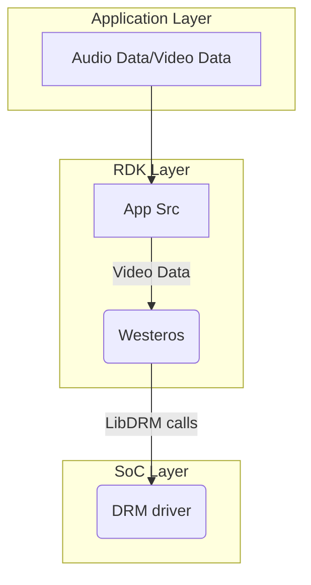
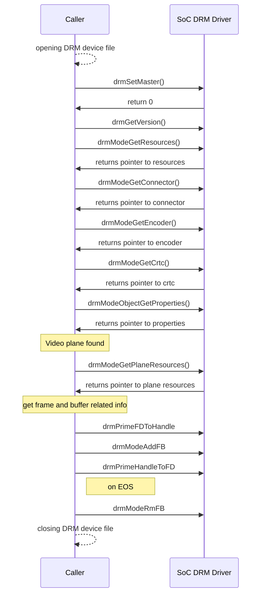

# LibDRM

## Version History

| Date [DD/MM/YY] | Comment | Version |
| --- | --- | --- |
| /08/23 | Initial review fixes	| 1.0.1 |
| 08/08/23 | First Release | 1.0.0 |

## Table of Contents

- [Description](#description)
  - [Introduction](#introduction)
  - [Acronyms, Terms and Abbreviations](#acronyms-terms-and-abbreviations)
  - [References](#references)
- [Component Runtime Execution Requirements](#component-runtime-execution-requirements)
  - [Initialization and Startup](#initializatio-and-startup)
  - [Threading Model](#threading-model)
  - [Process Model](#process-model)
  - [Memory Model](#memory-model)
  - [Power Management Requirements](#power-management-requirements)
  - [Asynchronous Notification Model](#asynchronous-notification-model)
  - [Blocking calls](#blocking-calls)
  - [Internal Error Handling](#internal-error-handling)
  - [Persistence Model](#persistence-model)
- [Non-functional requirements](#non-functional-requirements)
  - [Logging and debugging requirements](#logging-and-debugging-requirements)
  - [Memory and performance requirements](#memory-and-performance-requirements)
  - [Quality Control](#quality-control)
  - [Licensing](#licensing)
  - [Build Requirements](#build-requirements)
  - [Variability Management](#variability-management)
  - [Platform or Product Customization](#platform-or-product-customization)
- [Interface API Documentation](#interface-api-documentation)
  - [Theory of operation and key concepts](#theory-of-operation-and-key-concepts)
  - [Diagrams](#diagrams)
   - [libdrm Code Flow](#libdrm-code-flow)
  - [Data Structures and Defines](#data-structures-and-defines)

## Description
Libdrm is a library created to facilitate the interface of user-space programs with the DRM subsystem. This library is merely a wrapper that provides a function written in C for every ioctl of the DRM API, as well as constants, structures and other helper elements. The use of libdrm not only avoids exposing the kernel interface directly to applications, but presents the usual advantages of reusing and sharing code between programs.

### Introduction
In Westeros, the LibDRM module is responsible for managing the graphics and display hardware, providing a direct and efficient interface between the graphics hardware and the Westeros Renderer. This allows for efficient and high-performance rendering of graphical content and video streams, while also ensuring that the hardware is used in a secure and controlled manner. It provides a standardized interface for interacting with the graphics hardware, allowing the Westeros Renderer to access the hardware resources in a uniform and efficient manner. This helps to ensure that the graphics and video components of the system are properly synchronized and rendered in real-time.

### Acronyms, Terms and Abbreviations

- `HAL`    - Hardware Abstraction Layer
- `API`    - Application Programming Interface
- `RDK`    - Reference Design Kit for All Devices
- `SoC`    - System on Chip
- `DRM`    - Direct Rendering Manager
- `GPU`    - Graphics Processing Unit
- `wst`    - westeros
- `crtc`   - cathod ray tube controller
- `Caller` - Any user of the interface

### References
1. Downloadable libdrm files - [dri.freedesktop.org/libdrm/](https://dri.freedesktop.org/libdrm/)
2. An introduction to libdrm - [Beyond Linux® From Scratch (System V Edition)](https://www.linuxfromscratch.org/blfs/view/svn/x/libdrm.html)
3. Documentation on DRM and driver details - [DRM Internals](https://www.kernel.org/doc/html/v4.11/gpu/drm-internals.html)
4. Documentation on DRM module -  [Direct Rendering Manager](https://man.archlinux.org/man/drm.7.en)
5. Reference to open source libdrm code - [github.com/Distrotech/libdrm](https://github.com/Distrotech/libdrm)
6. Direct Rendering Manager - [wiki/Direct_Rendering_Manager](https://en.wikipedia.org/wiki/Direct_Rendering_Manager)

## Component Runtime Execution Requirements
Video or graphics rendering is dependent on the capability of the connected GPU and if no video card is connected, an error will be returned. Each GPU detected by DRM is referred to as a DRM device, and a device file /dev/dri/cardX (where X is a sequential number) is created to interface with it. User-space programs that want to talk to the GPU must open this file and use libdrm calls to communicate with DRM. 

These requirements ensure that the HAL executes correctly within the run-time environment that it will be used in. Failure to meet these requirements will likely result in undefined and unexpected behaviour.

### Initialization and Startup
The first call to the libdrm module would be drmSetMaster() to acquire the status of DRM master. IOCTL calls can only be invoked by the process considered the "master" of a DRM device, usually called DRM-Master. The display server is commonly the process that acquires the DRM-Master status in every DRM device it manages and keeps these privileges for the entire graphical session. A process can also give up its master role and let another process acquire it by calling the drmDropMaster() API.

### Threading Model
HAL is expected to be thread safe. Any caller invoking the APIs should ensure calls are made in a thread safe manner.

### Process Model
This interface is required to support a single instantiation with a single process.

### Memory Model
- drmModeAtomicAlloc() call allocates memory for a new drmModeAtomicReq structure for building a set of atomic mode setting or property modification requests and initializes its fields to zero.

### Power Management Requirements
This interface is not required to be involved in power management. In general, the SoC DRM driver should be designed to minimize the power consumption of the device.

### Asynchronous Notification Model
drmHandleEvent() call is used to handle events that are received by an application from the DRM module. It can be used to receive notifications of events such as hotplug, mode change, page flip, and VBlank events.

### Blocking calls
There are no blocking calls for this interface.

### Internal Error Handling
All the `APIs` must return error synchronously as a return argument. `HAL` is responsible for handling system errors (e.g. out of memory) internally.

### Persistence Model
There is no requirement for the interface to persist any settings information.

## Non-functional requirements

### Logging and debugging requirements
This interface is required to support DEBUG, INFO and ERROR messages. ERROR logs should be enabled by default. DEBUG and INFO is required to be disabled by default and enabled when needed.

### Memory and performance requirements
This interface is required to not cause excessive memory and CPU utilization. 

### Quality Control

- This interface is required to perform static analysis, our preferred tool is Coverity.
- Have a zero-warning policy with regards to compiling. All warnings are required to be treated as error.
- Copyright validation is required to be performed, e.g.: Black duck, FossID.
- Use of memory analysis tools like Valgrind are encouraged, to identify leaks/corruptions.
- `HAL` Tests will endeavour to create worst case scenarios to assist investigations.
- Improvements by any party to the testing suite are required to be fed back.

### Licensing
The `HAL` implementation is expected to released under the Apache License 2.0.

### Build Requirements
LibDRM code is downloaded from open source repo and build in platform to generate libdrm.so shared library file. The build mechanism must be independent of Yocto.

### Variability Management
Any changes in the `APIs` should be reviewed and approved by the component architects.

### Platform or Product Customization
No product customization is expected from SoC vendors from this module. Any potential platform specific customization needs to be communicated well in advance to the respective architect team for the purpose of effective planning.

## Interface API Documentation
`API` documentation will be provided by Doxygen which will be generated from the header files.

### Theory of operation and key concepts
When integrating with RDK layer, RDK middleware is expected to have complete control over the life cycle when calling the drm calls.

- There are several operations (ioctls) in the DRM API that either for security purposes or for concurrency issues must be restricted to be used by a single user-space process per device. To implement this restriction, DRM limits such ioctls to be only invoked by the process considered the "master" of a DRM device, usually called DRM-Master. Only one of all processes that have the device node /dev/dri/cardX opened will have its file handle marked as master, specifically the first calling the drmSetMaster() API. Any attempt to use one of these restricted ioctls without being the DRM-Master will return an error.

- LibDRM  is a kernel subsystem in linux that provides support for rendering graphics and managing display devices. It is reponsible for interacting with the graphics hardware and providing direct access to it. It enables hardware acceleration for video decoding and rendering.

- For video playback, the client application (like a media player) runs on top of the Wayland protocol communicating with the westeros-compositor. The compositor, in turn utuilizes the capabilities of this drm subsystem to facilitate efficient video rendering and display. The drm calls are made by the westeros-gl or westeros-sink-soc component.

- At different stages during the overall lifecycle of a video playback, drm calls are made that communicates with the lower level drivers.

- Following are the 38 mandatory libdrm calls for SOC Implementation: 
drmFreeVersion,
drmGetVersion,
drmHandleEvent,
drmModeAddFB,
drmModeAddFB2,
drmModeAddFB2WithModifiers,
drmModeAtomicAddProperty,
drmModeAtomicAlloc,
drmModeAtomicCommit,
drmModeAtomicFree,
drmModeCreatePropertyBlob,
drmModeDestroyPropertyBlob,
drmModeFreeConnector,
drmModeFreeCrtc,
drmModeFreeEncoder,
drmModeFreeObjectProperties,
drmModeFreePlane,
drmModeFreePlaneResources,
drmModeFreeProperty,
drmModeFreePropertyBlob,
drmModeFreeResources,
drmModeGetConnector,
drmModeGetCrtc,
drmModeGetEncoder,
drmModeGetPlane,
drmModeGetPlaneResources,
drmModeGetProperty,
drmModeGetPropertyBlob,
drmModeGetResources,
drmModeObjectGetProperties,
drmModePageFlip,
drmModeRmFB,
drmModeSetCrtc,
drmModeSetPlane,
drmPrimeFDToHandle,
drmPrimeHandleToFD,
drmSetMaster,
drmWaitVBlank.

### Diagrams

#### libdrm Code Flow

### Data Structures and Defines
SoC vendors should refer to the header files under the 'include' directory for API implementation: https://github.com/rdkcentral/libdrm-halif/tree/rdk-dev/include/
