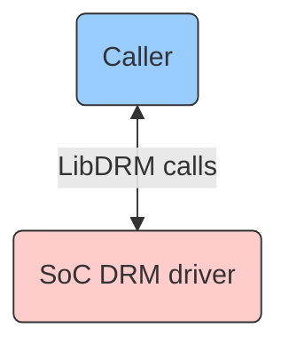
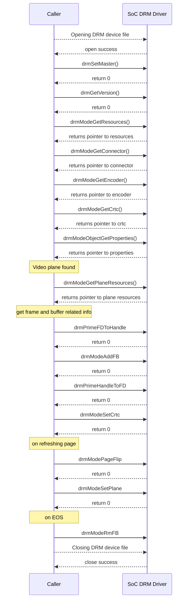

# LibDRM

## Version History

| Date [DD/MM/YY] | Comment | Version |
| --- | --- | --- |
| 08/08/23 | First Release | 1.0.0 |

## Table of Contents

- [Acronyms, Terms and Abbreviations](#acronyms-terms-and-abbreviations)
- [Description](#description)
  - [Introduction](#introduction)
  - [References](#references)
- [Component Runtime Execution Requirements](#component-runtime-execution-requirements)
  - [Initialization and Startup](#initializatio-and-startup)
  - [Threading Model](#threading-model)
  - [Process Model](#process-model)
  - [Memory Model](#memory-model)
  - [Power Management Requirements](#power-management-requirements)
  - [Asynchronous Notification Model](#asynchronous-notification-model)
  - [Blocking calls](#blocking-calls)
  - [Internal Error Handling](#internal-error-handling)
  - [Persistence Model](#persistence-model)
- [Non-functional requirements](#non-functional-requirements)
  - [Logging and debugging requirements](#logging-and-debugging-requirements)
  - [Memory and performance requirements](#memory-and-performance-requirements)
  - [Quality Control](#quality-control)
  - [Licensing](#licensing)
  - [Build Requirements](#build-requirements)
  - [Variability Management](#variability-management)
  - [Platform or Product Customization](#platform-or-product-customization)
- [Interface API Documentation](#interface-api-documentation)
  - [Theory of operation and key concepts](#theory-of-operation-and-key-concepts)
  - [Diagrams](#diagrams)
   - [libdrm Code Flow](#libdrm-code-flow)

## Acronyms, Terms and Abbreviations

- `HAL`       - Hardware Abstraction Layer
- `API`       - Application Programming Interface
- `SoC`       - System on Chip
- `DRM`       - Direct Rendering Manager
- `LibDRM`    - Direct Rendering Manager Library
- `GPU`       - Graphics Processing Unit
- `CRTC`      - cathod ray tube controller
- `DRM plane` - represents a layer of graphics that can be displayed on a `CRTC`
- `IOCTL`     - Input-Output Control
- `Caller`    - Any user of the interface

## Description
`LibDRM` is a library created to facilitate the interface of user-space programs with the `DRM` subsystem. This interface is a wrapper that provides a function for every `IOCTL` of the `DRM` `API`. The use of `LibDRM` not only avoids exposing the kernel interface directly to `caller`, but presents the usual advantages of reusing and sharing code between programs.

The diagram below shows the interaction between `caller` and `SoC` `DRM` Driver.

### Introduction
`LibDRM` is a userspace library for accessing the Direct Rendering Manager (`DRM`) on operating systems that support the `IOCTL` interface. `DRM` is a kernel-level `API` that provides access to the graphics hardware, such as the `GPU`, memory, and display connectors and thereby provides support for rendering graphics and managing display devices. It provides a standardized interface for interacting with the graphics hardware, allowing the `caller`'s renderer to access the hardware resources in a uniform manner. This helps to ensure that the graphics and video components of the system are properly synchronized and rendered in real-time while also ensuring that the hardware is used in a secure and controlled manner.

`LibDRM` provides a wrapper for the `DRM` `IOCTLs`, which makes it easier for userspace applications or `caller` to interact with the DRM driver.

### References
Documentation on DRM driver details - [DRM Internals](https://www.kernel.org/doc/html/v5.4/gpu/drm-internals.html)

## Component Runtime Execution Requirements
These requirements ensure that the `HAL` executes correctly within the run-time environment that it will be used in. Failure to meet these requirements will likely result in undefined and unexpected behaviour.

### Initialization and Startup
- Video or graphics rendering is dependent on the capability of the connected `GPU` and if no video card is connected, an error will be returned. Each `GPU` detected by `DRM` is referred to as a `DRM` device, and a device file /dev/dri/cardX (where X is a sequential number) is created to interface with it. User-space programs that want to talk to the `GPU` must open this file and use `LibDRM` calls to communicate with `DRM`.

- The first call to the `LibDRM` module will be `drmSetMaster()` to acquire the status of `DRM` master. `IOCTL` calls can only be invoked by the process considered the "master" of a `DRM` device (DRM-Master). The display server is the process that acquires the DRM-Master status in every `DRM` device it manages and keeps these privileges for the entire graphical session.

### Threading Model
`HAL` is expected to be thread safe. Any `caller` invoking the `APIs` should ensure calls are made in a thread safe manner.

### Process Model
This interface is required to support a single instantiation with a single process.

### Memory Model
The `LibDRM` `HAL` will own any memory that it creates and will also be responsible to free it. The `caller` will own the memory that it creates.

### Power Management Requirements
This interface is not required to be involved in power management. In general, the `SoC` `DRM` driver should be designed to minimize the power consumption of the device.

### Asynchronous Notification Model
`drmHandleEvent()` call is used to handle events that are received by the `caller` from the `DRM` module. It can be used to receive notifications of events such as hotplug, mode change, page flip, and VBlank events.

### Blocking calls
There are no blocking calls for this interface.

### Internal Error Handling
All the `APIs` must return error synchronously as a return argument. `HAL` is responsible for handling system errors (e.g. out of memory) internally.

### Persistence Model
There is no requirement for the interface to persist any settings information.

## Non-functional requirements

### Logging and debugging requirements
This interface is required to support DEBUG, INFO and ERROR messages. ERROR logs should be enabled by default. DEBUG and INFO is required to be disabled by default and enabled when needed.

### Memory and performance requirements
This interface is required to not cause excessive memory and CPU utilization. 

### Quality Control

- This interface is required to perform static analysis, our preferred tool is Coverity.
- Have a zero-warning policy with regards to compiling. All warnings are required to be treated as error.
- Copyright validation is required to be performed, e.g.: Black duck, FossID.
- Use of memory analysis tools like Valgrind are encouraged, to identify leaks/corruptions.
- `HAL` Tests will endeavour to create worst case scenarios to assist investigations.
- Improvements by any party to the testing suite are required to be fed back.

### Licensing
The `HAL` implementation is expected to released under the Apache License 2.0.

### Build Requirements
`LibDRM` code is downloaded from open source repo to generate `libdrm.so` shared library file. The build mechanism should be independent of Yocto.

### Variability Management
Any changes in the `APIs` should be reviewed and approved by the component architects.

### Platform or Product Customization
No product customization is expected from `SoC` vendors from this module. 

## Interface API Documentation
`API` documentation will be provided by Doxygen which will be generated from the header files.

### Theory of operation and key concepts
The `caller` is expected to have complete control over calling the `LibDRM` `APIs`.

- `DRM` exports `APIs` through `IOCTL`. `LibDRM` is a user mode library to wrap these `IOCTLs`. At different stages during the overall lifecycle of a video playback, `DRM` calls are made that communicate with the lower-level `SoC` `DRM` Driver.

1. `Caller` opens the `DRM` device node.

- There are several operations (`IOCTLs`) in the `DRM` `API` that either for security purposes or for concurrency issues must be restricted to be used by a single user-space process per device. To implement this restriction, `DRM` limits such `IOCTLs` to be only invoked by the process considered the "master" of a `DRM` device (DRM-Master). 
- Only one of the processes that have the device node (/dev/dri/cardX) opened will have its file handle marked as master, specifically the first one calling the `drmSetMaster()` `API`. Any attempt to use one of these restricted `IOCTLs` without being the DRM-Master will return an error.

2. `Caller` shall call `drmGetVersion()` to query the driver version information with the file descriptor of the `DRM` device as an argument and returns pointer to the `drmVersion` structure which should be freed with `drmFreeVersion()`.

3. `Caller` shall call `drmModeGetResources()` to get all the `drmModeRes` resources (includes fb, `CRTC`, encoder, connector, etc). `drmModeFreeResources()` is used to free the memory allocated.

- When a `caller` needs to interact with the `DRM` kernel subsystem for rendering, display, and other graphics-related functionality, it shall first obtain a handle to the `DRM` device and retrieve the available resources using `drmModeGetResources()`. `drmModeFreeResources()` should be called to release the allocated resources to prevent memory leaks.

4. The `caller` shall call `drmModeGetConnector()` to get the first connected connector(DRM_MODE_CONNECTED). `drmModeConnector()` stores all the supporting mode.

- `drmModeGetConnector()` is a connector function that retrieves all information about the connector. `drmModeFreeConnector()` is used to free the memory allocated to a `drmModeConnector` structure returned by `drmModeGetConnector()`.

5. The `caller` shall call `drmModeGetEncoder()`. If the encoder matches with the selected mode, save the `drmModeModeInfo` for later use. 

- `drmModeGetEncoder()` is an encoder function and is used to retrieve an encoder object associated with a given encoder id. The function returns a pointer to a `drmModeEncoder` structure that contains information about the encoder. `drmModeFreeEncoder()` is used to free the resources allocated.

6. The `caller` gets the display mode information for a `CRTC` by calling `drmModeGetCrtc()`. `Caller`  shall use `drmModeSetCrtc()` to set the display mode information for a `CRTC`. `drmModeFreeCrtc()` shall be used to free the resources allocated for a `CRTC`. The resources may include memory allocation or any associated properties.

7. `drmModeObjectGetProperties()` retrieves the properties of a `DRM` object associated with a `DRM plane`. `drmModeFreeObjectProperties()` frees the memory allocated by `drmModeObjectGetProperties()`.

8. `drmModeGetPlaneResources()` retrieves a list of available `DRM planes` in the system with their capabilities. `drmModeFreePlaneResources()` frees the allocated memory.

9. `drmPrimeFDToHandle()` returns the handle for the dma-buf file descriptor provided. `drmPrimeHandleToFD()` returns the dma-buf file descriptor for the handle provided.

10. `drmModeAddFB()` create a new framebuffer with the buffer object as its scan out buffer. `drmModeRmFB()` destroys the framebuffer allocated by `drmModeAddFB()`. `Caller` will `close()` the DRM device when EOS is reached.

- `drmModePageFlip()` does a page flip (framebuffer change) on the specified `CRTC`. By default, the `CRTC` will be reprogrammed to display the specified framebuffer after the next vertical refresh.

- Following are the 38 mandatory `LibDRM` `API` calls for `SoC` Implementation:

`drmFreeVersion()`, `drmGetVersion()`, `drmHandleEvent()`, `drmModeAddFB()`, `drmModeAddFB2()`, `drmModeAddFB2WithModifiers()`, `drmModeAtomicAddProperty()`, `drmModeAtomicAlloc()`, `drmModeAtomicCommit()`, `drmModeAtomicFree()`, `drmModeCreatePropertyBlob()`, `drmModeDestroyPropertyBlob()`, `drmModeFreeConnector()`, `drmModeFreeCrtc()`, `drmModeFreeEncoder()`, `drmModeFreeObjectProperties()`, `drmModeFreePlane()`, `drmModeFreePlaneResources()`, `drmModeFreeProperty()`, `drmModeFreePropertyBlob()`, `drmModeFreeResources()`, `drmModeGetConnector()`, `drmModeGetCrtc()`, `drmModeGetEncoder()`, `drmModeGetPlane()`, `drmModeGetPlaneResources()`, `drmModeGetProperty()`, `drmModeGetPropertyBlob()`, `drmModeGetResources()`, `drmModeObjectGetProperties()`, `drmModePageFlip()`, `drmModeRmFB()`, `drmModeSetCrtc()`, `drmModeSetPlane()`, `drmPrimeFDToHandle()`, `drmPrimeHandleToFD()`, `drmSetMaster()`, `drmWaitVBlank()`.

- `SoC` vendors can refer to the header files: xf86drm.h and xf86drmMode.h, for `API` implementation under the mentioned downloadable `LibDRM` package link: https://dri.freedesktop.org/libdrm/libdrm-2.4.100.tar.gz 

### Diagrams

#### General LibDRM Code Flow

